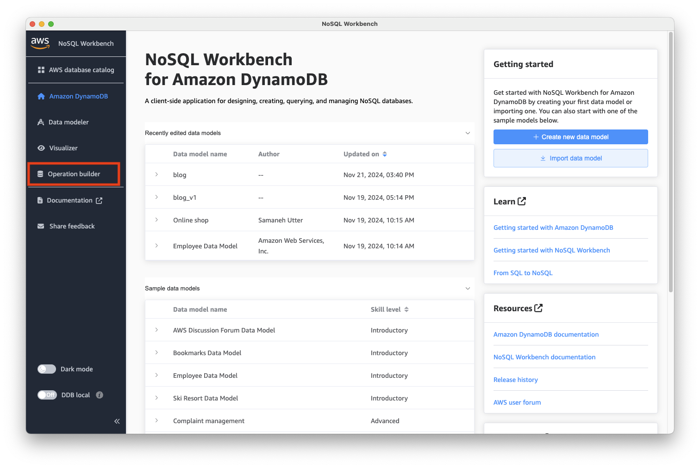
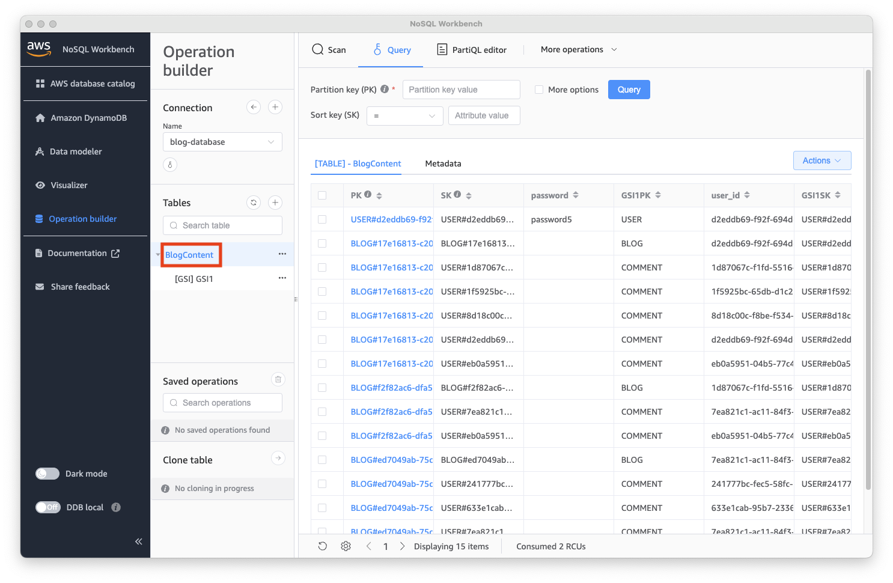

# Part 1: Technical Setup

## Requirements

In order to complete the challenge, the following are required to be installed and configured for
your local development environment (don't worry, we will walk you though this in the next section):

- [Git](https://git-scm.com/downloads)
- [homebrew](https://docs.brew.sh/)
- [Go](https://go.dev/doc/install) version 1.22+
- [Colima](https://github.com/abiosoft/colima)
- [NoSQL Workbench for DynamoDB](https://docs.aws.amazon.com/amazondynamodb/latest/developerguide/workbench.settingup.html)
- [VSCode](https://code.visualstudio.com/) (or a different IDE)

## Installing Requirements

### Git

Git should already installed on your machine. You can confirm this by running:

```bash
# check git version
git --version
```

If you dont have git installed, the above command will prompt you to install it.

### Homebrew

For this tech challenge, we are assuming that you are developing on a Mac. As such, we will be using
homebrew to install a lot of dependencies.

Homebrew can be installed by running the following commands

```bash
# install homebrew
/bin/bash -c "$(curl -fsSL https://raw.githubusercontent.com/Homebrew/install/HEAD/install.sh)"

# if you are on an Apple Silicone Mac, run the following to add homebrew to the PATH
(echo; echo 'eval "$(/opt/homebrew/bin/brew shellenv)"') >> ~/.zprofile eval "$(/opt/homebrew/bin/brew shellenv)"

# validate that homebrew is correctly installed. You may need to restart your terminal first
brew doctor
```

### Go

Go can be installed using homebrew by running the following commands:

```bash
# install go
brew install go
 
# confirm go installation
go version
```

### Colima (Docker)

Due do licencing restrictions, Docker Desktop cannot be installed on CapTech machines. As an
alternative, we recommend using colima, a CLI based docker engine, instead.

Colima and the docker engine can be installed with homebrew using the following commands:

```bash
# install colima with homebrew
brew install colima

# validate colima installation
colima --version

# install docker with homebrew
brew install docker

# install docker-compose with homebrew
brew install docker-compose
```

Once installed, you can start and stop colima using the following command:

```bash
# start colima
colima start

# stop colima
colima stop
```

> ---
>
>  If you run into an error such as:
>
>
> `Cannot connect to the Docker daemon at unix:///var/run/docker.sock. 
> Is the docker daemon running?`
>
> please reference this
> [help article](https://github.com/abiosoft/colima/blob/main/docs/FAQ.md#cannot-connect-to-the-docker-daemon-at-unixvarrundockersock-is-the-docker-daemon-running).
>
> ---

> ---
>
> If you run into an error such as: `docker: 'compose' is not a docker command.`, try the following:
>
> - Create a symlink to the docker-compose plugin by running the following command:
>  ```bash
>  [ ! -d "~/.docker/cli-plugins" ] && mkdir -p "~/.docker/cli-plugins" && ln -s /opt/homebrew/opt/docker-compose/bin/docker-compose ~/.docker/cli-plugins/docker-compose
>  ```
>
> ---

### NoSQL Workbench for DynamoDB 

NoSQL Workbench for DynamoDB is an AWS tool for designing and managing DynamoDB tables. You can install it by following the instructions [here](https://docs.aws.amazon.com/amazondynamodb/latest/developerguide/workbench.settingup.html).

### VSCode

It is recommended to use [Visual Studio Code](https://code.visualstudio.com/) as your IDE while
working through this tech challenge. This is because Visual Studio has a rich set of extensions that
will aid you as you progress through the exercise. However, you are free to use your preferred IDE.

VSCode can be installed either manually by going to
the [VSCode website](https://code.visualstudio.com/) or by running the following commands:

```bash
# install VSCode with homebrew
brew install --cask visual-studio-code
```

After installing Visual Studio Code, you should head to the Extensions tab and install the following
extensions\*:

- [Go](https://marketplace.visualstudio.com/items?itemName=golang.Go)
  
Other useful VS Code extensions include:

- [ENV](https://marketplace.visualstudio.com/items?itemName=IronGeek.vscode-env)

\*Note that you may have to restart VSCode after installing some extensions for them to take effect.

## Repository Setup

Create your own repository using the `Use this template` in the top right of the webpage. Make
yourself the owner, and give the repository the same name as the template (
Go-API-DynamoDB-Tech-Challenge).
Once your repository is cloned locally, you are all set to move on to the next step.

## Database Setup

To reduce developer friction, we have provided a docker-compose file that will create a locally running DynamoDB
 instance for you. To start the database, run the following command:

```bash
# start the database
docker compose up
```

Now that the database is running, we can seed it with data. To do this, run the following command:

```bash
# seed the database
make seed-database
```

> Note, if you need to reset your database and reseed it with default data, you can do so by running the following command:
> ```bash
> make reset-database && make seed-database
> ```

Now that the database is running and seeded with data, we can connect to it using DBeaver.

- First, open NoSQL Workbench and select `Operation Builder` from the side menu.:
    
  
- Next, click `+ Add connection`:
    
  
- In the `Ad a new database connection` popup, select `DynamoDB Local` and then fill out the connection details as shown bellow and click `BlogConnect`:
    

- You should now see a new connection in the `Operation Builder`! Click on `open`:
    

- You should now see the `Operation builder` view. To see the data in the database, click on the table name `Content` in the left hand menu:
    
  
Congratulations! You have connected your local DynamoDB instance to NoSQL Workbench and can now use the workbench to explore data and practice making queries.

## Create Go Module and Install Necessary Libraries

To create your Go project, open a terminal in the root project directory and run the following
command, replacing `[name]` with your name.

```bash
go mod init github.com/[name]/blog && go mod tidy
```

Next, run the following commands that will install the required libraries for the tech challenge.

```bash
go get github.com/caarlos0/env/v11
go get github.com/joho/godotenv
go get github.com/aws/aws-sdk-go-v2/aws
go get github.com/aws/aws-sdk-go-v2/config
go get github.com/aws/aws-sdk-go-v2/feature/dynamodb/attributevalue
go get github.com/aws/aws-sdk-go-v2/service/dynamodb
go get github.com/aws/aws-sdk-go-v2/service/dynamodb/types
go get github.com/swaggo/http-swagger/v2
go get github.com/google/uuid
go get github.com/swaggo/swag@latest
go get github.com/stretchr/testify
go install github.com/swaggo/swag/cmd/swag@latest
go install github.com/vektra/mockery/v2@v2.49.0
```

## Next Steps

So far, you have set up the database, initiated the go application, and installed the necessary
libraries to complete this tech challenge. In part 2, we will go over the basics of creating a REST
API using the net/http library. We will also be connecting to our database to perform standard
read/write operations. Last, we'll create unit tests for our application to ensure we meet our
required 80% code coverage. Click [here](./2-REST-API-Walkthrough.md) to proceed to part 2. You also
have the option to skip the walkthrough if you are familiar with writing a REST API in Go. In that
case, click [here](./3-Challenge-Assignment.md) to proceed to part 3.
