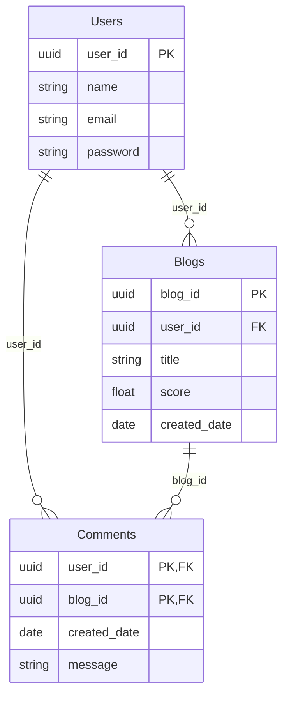

# Part 3: Tech Challenge Assignment

## Overview

For this assignment, you will be creating a Blog API. This API will be responsible for exposing endpoints that allow users to perform Create, Read, Update, and Delete (CRUD) operations on information related to blogs, users, and comments.

## Database Overview

As we have already seen, the database contains three different entity types: Users, Blogs, and Comments. As was also already mentioned, we are following AWS best practices which means that we are using a single table to hold all three different entity types.

Bellow is an Entity-Relationship Diagram (ERD) that represents the relationship between the three different entity types. Note that these are not the actual tables in the database, but rather a visual representation of the relationships between the entity types.

The `Users` entity represents standard information relating to a user, including their name, email, and password. For the user's password, you are expected to use standard encryption to store their passwords within the database.

The `Blogs` entity represents pertinent information relating to a blog, including the title, score, and created date of the blog. The `Blogs` entity also contains an author's id that referencing the id of the user who created the blog. This association represents a one-to-many association between Users entities and the `Blogs` entities.

The final entity, `Comments`, represents the comments that users have written for the blogs. Because users can write many comments for different blogs and blogs can have many comments written by different users, the `Comments` entity represents an intermediate entity for the many-to-many relationship between `Users` and `Blogs`. As such, the `Comments` entity uses a composite key (the user's id and the blog's id) to distinguish entities. Other information stored for each comment includes the date and time the comment was written, and the message wrote by the user on the comment.

> [!NOTE]
> For the sake of simplicity, it is assumed that a user can leave only one comment per blog.

We recommend that you use NoSQL Workbench to explore the data in the database and to practice making queries. Items to explore include: 
- How the different entities are stores
- How the existing Global Secondary Index (GSI) is used
- How partition and sort keys have been overloaded
You can find instructions on how to connect to the database using NoSQL Workbench in the [Technical Setup](./1-Technical-Setup.md) document.

Also note that as you continue with this tech challenge, you are expected to use best practices when interacting with the database. These best practices include, but are not limited to: 
- Using the AWS SDK to interact with the database
    - using the `attributevalue` package to convert Go structs to DynamoDB items
    - sing the `dynamodb` package to interact with the database
- Being aware of the performance costs of different operations and using the most efficient operations to interact with the database
    - Ex., you are expected to not use a scan action to retrieve all items

## API Structure

Your project will need to define 3 groups of endpoints, one for each of the entities (`Users`, `Blogs`, and `Comments`). Each group will need to include handlers for `get all`, `get by id`, `update by id`, `add`, and `delete` actions. Additionally, there are bonus endpoints that you can challenge yourself to complete alongside those required. All endpoints should include error handling and input validation, when necessary. Your project should also have a single main entrypoint to run the project.

Below are the details for the required and optional endpoints

---

### Required Endpoints - Users
| Request Type | Endpoint | Query Parameters | Request Body | Response Type | Instructions |
| --- | ---| --- | --- | --- | --- |
| GET | http://localhost:8000/api/user | `name`: string | *none* | JSON-formatted string representing a list of `User` objects | Return all `User` objects from the database. If the `name` parameter is provided, filter the returned list by name. |
| GET | http://localhost:8000/api/user/{id} | *none* | *none* | JSON-formatted string representing a `User` object | Return a given `User` object based on `id`. |
| PUT | http://localhost:8000/api/user/{id} | *none* | JSON-formatted string representing a `User` object | JSON-formatted string representing an updated `User` object | Update a given `User` object in the database based on `id`. The `User` object passed to the endpoint should be validated. |
| POST | http://localhost:8000/api/user | *none* | JSON-formatted string representing a `User` object | JSON-formatted string representing the new `User` object | Add a new `User` object to the database. `id` should be generated by your application. |
| DELETE | http://localhost:8000/api/user/{id} | *none* | *none* | JSON-formatted string representing a deletion confirmation message | Delete a given `User` object from the database based on `id`. **IMPORTANT**: All `Blog` objects and `Comment` objects in the database related to the deleted `User` should also be deleted. |

### Required Endpoints - Blogs
| Request Type | Endpoint | Query Parameters | Request Body | Response Type | Instructions |
| --- | ---| --- | --- | --- | --- |
| GET | http://localhost:8000/api/blog | `title`: string | *none* | JSON-formatted string representing a list of `Blog` objects | Return all `Blog` objects from the database. If the `title` parameter is provided, filter list by title. |
| GET | http://localhost:8000/api/blog/{id} | *none* | *none* | JSON-formatted string representing a `Blog` object | Return a given `Blog` object based on `id`. |
| PUT | http://localhost:8000/api/blog/{id} | *none* | JSON-formatted string representing a `Blog` object | JSON-formatted string representing an updated `Blog` object | Update a given `Blog` object in the database based on `id`. The `Blog` object passed to the endpoint should be validated. Additionally, the `user_id` should be validated to ensure that a user exists with that id. The `Blog` object returned should represent the updated `Blog`. |
| POST | http://localhost:8000/api/blog | *none* | JSON-formatted string representing a `Blog` object | JSON-formatted string representing the new `Blog` object | Add a new `Blog` object to the database. `id` and `created_date` should be generated by your application. The `Blog` object passed into the endpoint should be validated. Additionally, the `user_id` should be validated to ensure that a user exists with that id. The `Blog` object returned should represent the newly-created `Blog`. |
| DELETE | http://localhost:8000/api/blog/{id} | *none* | *none* | JSON-formatted string representing a deletion confirmation message | Delete a given `Blog` object from the database based on `id`. **IMPORTANT**: All `Comment` objects in the database related to the deleted `Blog` should also be deleted. |

**Optional Challenge**: Create a new return type for `Blog` objects returned in which the author name is returned instead of their id.

### Required Endpoints - Comments
| Request Type | Endpoint | Query Parameters | Request Body | Response Type | Instructions                                                                                                                                                                                                                                                                                                                                                                                                                                                                                                                                        |
| --- | ---| --- | --- | --- |-----------------------------------------------------------------------------------------------------------------------------------------------------------------------------------------------------------------------------------------------------------------------------------------------------------------------------------------------------------------------------------------------------------------------------------------------------------------------------------------------------------------------------------------------------|
| GET | http://localhost:8000/api/comment | `user_id`: string `blog_id`: string | *none* | JSON-Formatted string representing a list of `Comment` objects | Return all `Comment` objects from the database. If the `user_id` or `blog_id` parameters are provided, filter off of them.                                                                                                                                                                                                                                                                                                                                                                                                                          |
| GET | http://localhost:8000/api/comment/{blog_id}/{user_id} | *none* | *none* | JSON-Formatted string representing a list of `Comment` objects | Return a given `Comment` objects based on `user_id` and `blog_id`.                                                                                                                                                                                                                                                                                                                                                                                                                                                                                  |
| PUT | http://localhost:8000/api/comment/{blog_id}/{user_id} | *none* | JSON-formatted string representing a `Comment` object | JSON-formatted string representing an updated `Comment` object | Updated a given `Comment` object in the database based on the `user_id` and `blog_id`. The `Comment` object passed to the endpoint should be validated. Additionally, the path parameters for `user_id` and `blog_id` should be validated to ensure that they match. Lastly, the `Comment` object should be validated. The `Comment` object returned should represent the updated `Comment`.                                                     |
| POST | http://localhost:8000/api/comment | *none* | JSON-formatted string representing a `Comment` object | JSON-formatted string representing the newly `Comment` object | Add a new `Comment` object to the database. The `created_date` should be generated by your application. The `Comment` object passed to the endpoint should be validated. Additionally, the `Comment` object should be validated to ensure that there exists a user and a blog with id's matching the given `user_id` and `blog_id`. The `Comment` object returned should represent the new `Comment`. |
| DELETE | http://localhost:8000/api/http://localhost:8000/api/comment/{blog_id}/{user_id} | *none* | *none* | JSON-formatted string representing a deletion confirmation message | Delete a given `Comment` object from the database based on `user_id` and `blog_id`.                                                                                                                                                                                                                                                                                                                                                                                                                                                                 |

**Optional** Create a new return type for `Comment` objects returned in which the commenter's name is returned instead of their id and the blog's title is returned instead of its id. 

### Optional Endpoints - Users
| Request Type | Endpoint | Query Parameters | Request Body | Response Type | Instructions |
| --- | ---| --- | --- | --- | --- |
| GET | http://localhost:8000/api/user/{id}/blogs | *none* | *none* | JSON-formatted string representing a list of the blogs written by a user | Return a list of blogs written by a `User` based on `id`. The returned list should be a simple string array representing the titles of every `Blog` written by the `User` with the specified `id`. |

### Optional Endpoints - Blogs
| Request Type | Endpoint | Query Parameters | Request Body | Response Type | Instructions |
| --- | ---| --- | --- | --- | --- |
| GET | http://localhost:8000/api/blog/{id}/comments | *none* | *none* | JSON-formatted string representing a list of the comments written for a blog | Return a list of comments written for a `Blog` based on `id`. The returned list should be a formatted list of objects containing the commenter's name and the date and time the comment was made. |

## Project Requirements Checklist

- [ ] Your API should use port `8080`
- [ ] Your API should have a single entry point.
- [ ] Each endpoint should return the appropriate status code with each response, including for errors.
- [ ] If an error is encountered by the application, an informative error message should be returned to the client.
- [ ] The swagger spec should document all the required and optional endpoints, including their parameters, request body structure, and response types.
- [ ] Your project should include unit tests with 80% test coverage (you can exempt package `main` from code coverage).
- [ ] You should have panic recovery middleware to handle any panics that occur in your application.

## Final

Once you completed your project, ensure that the main branch in your fork is up-to-date with your latest code. We recommend that you work with a Go SME to review and grade your project. This feedback is key for you to keep improving your Go skills!
